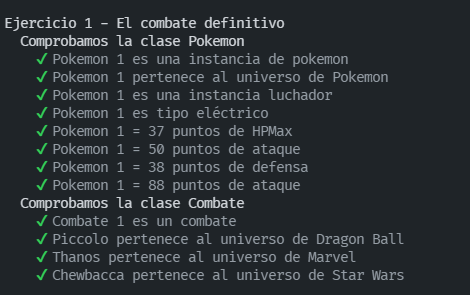
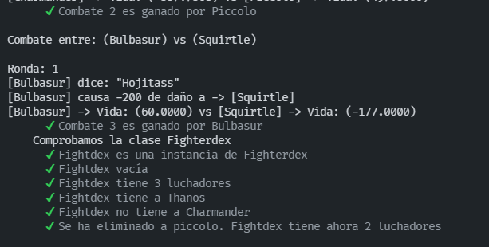
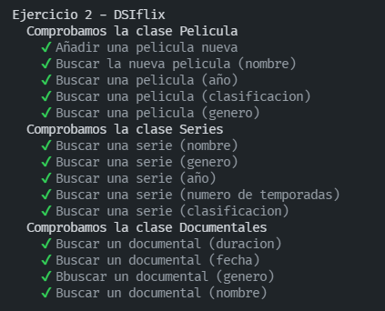
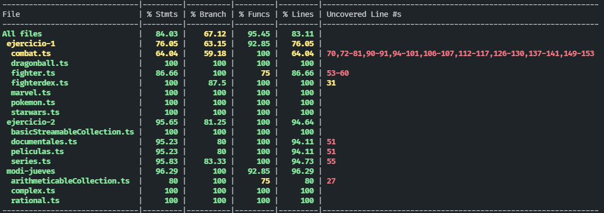

# Práctica 6 - Clases e interfaces genéricas. Principios SOLID

## Índice
- [1. Introducción](#introduccion)
- [2. Pasos](#previos)
- [3. Desarrollo de los ejercicios](#desarrollo)
  - [Ejercicio 1](#ejercicio1)
  - [Ejercicio 2](#ejercicio2)
  - [Ejercicio 3](#ejercicio3)
- [4 Cubrimiento del codigo](#cubrimiento)
- [5. Dificultades y conclusion](#conclusion)
- [6. Referencias](#referencias)

## 1. Introducción<a name="introduccion"></a>

En esta sexta práctica vamos a profundizar en el uso de clases abtractas y genéricas así como interfaces. Durante todo el desarrollo de este ejercicio vamos a procurar aplicar los principios S y O de SOLID. Para más información, en esta página sobre [los principios SOLID de Typescript](https://samueleresca.net/solid-principles-using-typescript/) explica de manera más detallada.

Además de lo previamente mencionado vamos a trabajar con Instanbul y con Converalls. Gracias a Instanbul podremos tener una métrica de cuánto código hemos cubierto con nuestras pruebas mediante el desarrollo **TDD**. PAra más información sobre [Instanbul](https://istanbul.js.org/).

## 2. Pasos<a name="previos"></a>
Antes de comenzar con el desarrollo de código fuente vamos a generar nuestra estructura de trabajo. Tanto en la práctica pasada como en esta y todas las posteriores seguirán la misma estructura. Tendremos un directorio **/src**. En este directorio crearemos otros **subdirectorios**, uno por cada ejercicio, donde almacenamos el código de cada uno de ellos. Estos subdirectorios siguen la nomenclatura de **ejercicio-X**.

Además, debemos tener instalado (al igual la práctica anterior) **Typedoc, Mocha y Chai**. A estas herramientas vamos a añadir una nueva: *Instanbul*.
Estos siguentes tutoriales proporcionados por el profesor son las herrramientas para instalarlo en caso de tener alguna duda:
- [Tutorial Typedoc](https://drive.google.com/file/d/19LLLCuWg7u0TjjKz9q8ZhOXgbrKtPUme/view)
- [Tutorial Mocha y Chai](https://drive.google.com/file/d/1-z1oNOZP70WBDyhaaUijjHvFtqd6eAmJ/view)
- [Tutorial Instanbul](https://drive.google.com/file/d/1xLDc4CpoYpsAlCFO_4DMwu7MKCtcZDnh/view)

## 3. Desarrollo de la práctica <a name="desarrollo"></a>

**[Acceso a la documentación generada con Typedoc.](https://github.com/ULL-ESIT-INF-DSI-2122/ull-esit-inf-dsi-21-22-prct06-generics-solid-alu0101128894/tree/master/docum)**

**[Acceso al directorio de código fuente (src).](https://github.com/ULL-ESIT-INF-DSI-2122/ull-esit-inf-dsi-21-22-prct06-generics-solid-alu0101128894/tree/master/src)**

**[Acceso al directorio de pruebas unitarias (Tests).](https://github.com/ULL-ESIT-INF-DSI-2122/ull-esit-inf-dsi-21-22-prct06-generics-solid-alu0101128894/tree/master/tests)**

**[Guión de la práctica 6.](https://ull-esit-inf-dsi-2122.github.io/prct06-generics-solid/)**

### Ejercicio 1. - El Combate definitivo <a name="ejercicio1"></a>

[Acceso al código (Typescript).](https://github.com/ULL-ESIT-INF-DSI-2122/ull-esit-inf-dsi-21-22-prct06-generics-solid-alu0101128894/tree/master/src/ejercicio-1)

[Acceso a las pruebas.](https://github.com/ULL-ESIT-INF-DSI-2122/ull-esit-inf-dsi-21-22-prct06-generics-solid-alu0101128894/blob/master/tests/ejercicio-1.spec.ts)

Partimos del código desarrollado en la práctica anterior. En primer lugar se nos pide desarrollar una clase abstracta denominada `Fighter`. Esta será la superclase que será heredada por cada uno de los distintos tipos de combatientes.

Primero declaramos un tipo de dato denominado `stats` donde almacenamos la vida, el ataque, la defensa y la velocidad.

En cuanto a la clase `Fighter` tenemos 6 atributos: el **nombre, apellido, peso, altura, las estadisticas y la vida durante el combate**. Como funciones tenemos 7 getters y una función, `restarHP`, cuyo objetivo es ir restando el daño recibido a la vida del combate. Vemos que tenemos un getter como método abstracto, `getUniverso()`. Esto nos permite que podamos "sobreescribir" el método en las clases derivada.

```ts
export type Stats = {
  HPMax: number,
  ataque: number,
  defensa: number,
  velocidad: number
}
export abstract class Fighter {
  private HPCombate: number = 0;
  constructor(
    private readonly nombre: string,
    private readonly peso: number,
    private readonly altura: number,
    private readonly frase: string,
    private readonly estadisticas: Stats) {
    this.HPCombate = estadisticas.HPMax;
  }
  restarHP(daño: number) {
    this.HPCombate -= daño;
  }
  getNombre() {
    return this.nombre;
  }
  getPeso() {
    return this.peso;
  }
  getAltura() {
    return this.altura;
  }
  getHPCombate() {
    return this.HPCombate;
  }
  getStats() {
    return this.estadisticas;
  }
  getFrase() {
    return this.frase;
  }
  abstract getUniverso(): string;
}
```
Entonces, por ende, a partir de esta clase `Fighter` vamos a desarrollar las clases para cada uno de los combatientes, a partir de sus universos. En nuestro caso hemos decidido crear las clases `Marvel`, `Pokemon`, `Star Wars` y `Dragon Ball`.

Clase `Pokemon`:
```ts
import {Fighter, Stats} from './fighter';
export class Pokemon extends Fighter {
  private universo: string = 'Pokemon';
  constructor(
    nombre: string,
    private readonly tipo: string,
    peso: number,
    altura: number, 
    frase: string, 
    estadisticas: Stats) {
    super(nombre, peso, altura, frase, estadisticas);
  }
  getUniverso() {
    return this.universo;
  }
  getTipo() {
    return this.tipo;
  }
}
```
Se puede comprobar que el getter de `getUniverso()` son prácticamente lo mismo, hay unas diferencias en **Pokemon** que tiene unos valores como nombre, peso, altura, etc...

La siguiente clase es: `Combat`, es prácticamente parecido:

```ts
export class Combat {
  private datoAtaque: number[] = new Array(2);

  constructor(
    public readonly fighter1: Fighter,
    public readonly fighter2: Fighter) { }

  combatir() {
    this.calcularAtaque();
    let iterator: number = 1;

    console.log('\nCombate entre: (' + this.fighter1.getNombre() + ') vs (' + this.fighter2.getNombre() + ")");
    
    while ((this.fighter1.getHPCombate() > 0) && (this.fighter2.getHPCombate() > 0)) {
      console.log("\nRonda: " + iterator);
      if ((iterator % 2) == 0) {
        console.log("[" + this.fighter2.getNombre() + '] dice: "' + this.fighter2.getFrase() + '"');
        console.log("[" + this.fighter2.getNombre() + "] causa -" + this.datoAtaque[1] + " de daño a -> [" + this.fighter1.getNombre() + "]");
        this.fighter1.restarHP(this.datoAtaque[1]);
      } else {
        console.log("[" + this.fighter1.getNombre() + '] dice: "' + this.fighter1.getFrase() + '"');
        console.log("[" + this.fighter1.getNombre() + "] causa -" + this.datoAtaque[0] + " de daño a -> [" + this.fighter2.getNombre() + "]");
        this.fighter2.restarHP(this.datoAtaque[0]);
      }
      iterator++;
      console.log("[" + this.fighter1.getNombre() + "] -> Vida: (" +(this.fighter1.getHPCombate()).toFixed(4) + ") vs [" + this.fighter2.getNombre() + 
      "] -> Vida: (" + (this.fighter2.getHPCombate()).toFixed(4)  + ")");
    }
    return (this.fighter1.getHPCombate() <= 0) ? (this.fighter2.getNombre() + ' gana.') : (this.fighter1.getNombre() + ' gana.')
  }
  calcularAtaque() {
    this.datoAtaque[0] = this.calculoCombate(this.fighter1, this.fighter2);
    this.datoAtaque[1] = this.calculoCombate(this.fighter2, this.fighter1);
  }
  calculoCombate(luchador1: Fighter, luchador2: Fighter): number {
    let universo1: string = luchador1.getUniverso();
    let universo2: string = luchador2.getUniverso();
    let ataque: number = luchador1.getStats().ataque;
    let defensa: number = luchador2.getStats().defensa;
    let efectividad: number = 0; 
    if (universo1 === universo2) {
      if ((luchador1 instanceof Pokemon) && (luchador2 instanceof Pokemon)) {
        let tipo1 = luchador1.getTipo();
        let tipo2 = luchador2.getTipo();
        if (tipo1 === tipo2) {
          efectividad = 0.5;
        } else if (tipo1 === 'Fuego') {
          switch (tipo2) {
            case 'Hierba':
              efectividad = 2;
              break;
            case 'Electrico':
              efectividad = 1;
              break;
            case 'Agua':
              efectividad = 0.5;
              break;
          }
        } else if (tipo1 === 'Agua') {
          switch (tipo2) {
            case ('Hierba'):
            case ('Electrico'):
              efectividad = 0.5;
              break;
            case 'Fuego':
              efectividad = 2;
              break;
          }
        } else if (tipo1 === 'Electrico') {
          switch (tipo2) {
            case ('Fuego'):
            case ('Hierba)'):
              efectividad = 1;
              break;
            case 'Agua':
              efectividad = 2;
              break;
          }
        } else {
          switch (tipo2) {
            case 'Electrico':
              efectividad = 1;
              break;
            case 'Agua':
              efectividad = 2;
              break;
            case 'Fuego':
              efectividad = 0.5;
              break;
          }
        }
      } else {
        efectividad = 1;
      }
    } else {
      if (universo1 == 'Pokemon') {
        switch (universo2) {
          case 'Dragon Ball':
            efectividad = 0.5;
            break;
          case 'Star Wars':
            efectividad = 1.5;
            break;
          case 'Marvel':
            efectividad = 1;
            break;
        }
      } else if (universo1 == 'Dragon Ball') {
        efectividad = 0.5;
      } else if (universo1 == 'Star Wars') {
        switch (universo2) {
          case 'Dragon Ball':
            efectividad = 0.5;
            break;
          case 'Pokemon':
            efectividad = 1;
            break;
          case 'Marvel':
            efectividad = 1;
            break;
        }
      } else if (universo1 == 'Marvel') {
        switch (universo2) {
          case 'Dragon Ball':
            efectividad = 0.5;
            break;
          case 'Pokemon':
            efectividad = 1;
            break;
          case 'Star Wars':
            efectividad = 1;
            break;
        }
      }
    }
    let daño: number = 50 * (ataque / defensa) * efectividad;
    return parseFloat(daño.toFixed(4));
  }
}
```
Y por último la clase `Fighterdex`, que es una evolución de la anterior práctica `Pokedex`. Simplemente almacena los personajes de cualquier universo.

En la que contiene un **addFighter, deleteFighter, fighterdexSize y buscarLuchador**
```ts
export class Fighterdex {
  constructor(
    private fighterBase: Fighter[]) {};

  addFighter(luchador: Fighter) {
    this.fighterBase.push(luchador);
  }
  deleteFighter(luchador: Fighter) {
    let pos: number = -1;
    this.fighterBase.forEach((iterador) => {
      if (iterador === luchador) {
        pos = this.fighterBase.indexOf(iterador);
      }
    });
    return (pos == -1) ? 'No existe' : this.fighterBase.splice(pos, 1);
  };
  fighterdexSize(): number {
    return this.fighterBase.length;
  }
  buscarLuchador(luchador: Fighter) {
    let pos: number = -1;
    this.fighterBase.forEach((iterador) => {
      if (iterador === luchador) {
        pos = this.fighterBase.indexOf(iterador);
      }
    });
    if (pos == -1) {
      return null;
    } else {
      return this.fighterBase[pos];
    }
  }
};
```

**TESTS REALIZADOS**

```ts
import 'mocha';
import {expect} from 'chai';
import {Combat} from '../src/ejercicio-1/combat';
import {Marvel} from '../src/ejercicio-1/marvel';
import {Pokemon} from '../src/ejercicio-1/pokemon';
import {DragonBall} from '../src/ejercicio-1/dragonball';
import {StarWars} from '../src/ejercicio-1/starwars';
import {Fighter} from '../src/ejercicio-1/fighter';
import {Fighterdex} from '../src/ejercicio-1/fighterdex';

describe('Ejercicio 1 - El combate definitivo', () => {
  describe('Comprobamos la clase Pokemon', () => {
    let pokemon1 = new Pokemon('Charmander', 'Electrico', 10, 7, 'Uuuh', {HPMax: 37, ataque: 50, defensa: 38, velocidad: 88});

    it('Pokemon 1 es una instancia de pokemon', () => {
      expect(pokemon1).to.be.instanceOf(Pokemon);
    });

    it('Pokemon 1 pertenece al universo de Pokemon', () => {
      expect(pokemon1.getUniverso()).to.be.equal('Pokemon');
    });

    it('Pokemon 1 es una instancia luchador', () => {
      expect(pokemon1).to.be.instanceOf(Fighter);
    });

    it('Pokemon 1 es tipo eléctrico', () => {
      expect(pokemon1.getTipo()).to.be.equal('Electrico');
    });
    it('Pokemon 1 = 37 puntos de HPMax', () => {
      expect(pokemon1.getStats().HPMax).to.be.equal(37);
    });
    it('Pokemon 1 = 50 puntos de ataque', () => {
      expect(pokemon1.getStats().ataque).to.be.equal(50);
    });
    it('Pokemon 1 = 38 puntos de defensa', () => {
      expect(pokemon1.getStats().defensa).to.be.equal(38);
    });
    it('Pokemon 1 = 88 puntos de ataque', () => {
      expect(pokemon1.getStats().velocidad).to.be.equal(88);
    });
  });

  describe('Comprobamos la clase Combate', () => {
    let charmander = new Pokemon('Charmander', 'Electrico', 10, 70, 'Uuuh', {HPMax: 37, ataque: 50, defensa: 38, velocidad: 88});
    let squirtle = new Pokemon('Squirtle', 'Agua', 5, 30, 'Jeje', {HPMax: 23, ataque: 8, defensa: 40, velocidad: 22});
    let bulbasur = new Pokemon('Bulbasur', 'Hierba', 58, 195, 'Hojitass', {HPMax: 60, ataque: 80, defensa: 56, velocidad: 145});
    let piccolo = new DragonBall('Piccolo', 80, 190, 'Grrr', {HPMax: 500, ataque: 600, defensa: 500, velocidad: 250});
    let thanos = new Marvel('Thanos', 220, 275,'Bye bye', {HPMax: 400, ataque: 300, defensa: 450, velocidad: 150});
    let chewbacca = new StarWars('Chewbacca', 230, 300,'Uuuur', {HPMax: 500, ataque: 550, defensa: 500, velocidad: 250});

    let combate1 = new Combat(chewbacca, thanos);
    let combate2 = new Combat(charmander, piccolo);
    let combate3 = new Combat(bulbasur, squirtle);

    it('Combate 1 es un combate', () => {
      expect(combate1).to.be.instanceOf(Combat);
    });

    it('Piccolo pertenece al universo de Dragon Ball', () => {
      expect(piccolo.getUniverso()).to.be.equal('Dragon Ball');
    });
    it('Thanos pertenece al universo de Marvel', () => {
      expect(thanos.getUniverso()).to.be.equal('Marvel');
    });
    it('Chewbacca pertenece al universo de Star Wars', () => {
      expect(chewbacca.getUniverso()).to.be.equal('Star Wars');
    });

    it('Combate1 es ganado por Chewbacca', () => {
      expect(combate1.combatir()).to.be.equal('Chewbacca gana.');
    });

    it('Combate 2 es ganado por Piccolo', () => {
      expect(combate2.combatir()).to.be.equal('Piccolo gana.');
    });

    it('Combate 3 es ganado por Bulbasur', () => {
      expect(combate3.combatir()).to.be.equal('Bulbasur gana.');
    });
  });

  describe('Comprobamos la clase Fighterdex', () => {
    let charmander = new Pokemon('Charmander', 'Electrico', 10, 70, 'Uuuh', {HPMax: 37, ataque: 50, defensa: 38, velocidad: 88});
    let piccolo = new DragonBall('Piccolo', 80, 190, 'Grrr', {HPMax: 500, ataque: 600, defensa: 500, velocidad: 250});
    let thanos = new Marvel('Thanos', 220, 275,'Bye bye', {HPMax: 400, ataque: 300, defensa: 450, velocidad: 150});
    let chewbacca = new StarWars('Chewbacca', 230, 300,'Uuuur', {HPMax: 500, ataque: 550, defensa: 500, velocidad: 250});

    let fightdex = new Fighterdex([]);

    it('Fightdex es una instancia de Fighterdex', () => {
      expect(fightdex).to.be.instanceOf(Fighterdex);
    });

    it('Fightdex vacía', () => {
      expect(fightdex.fighterdexSize()).to.be.equal(0);
    });

    it('Fightdex tiene 3 luchadores', () => {
      fightdex.addFighter(chewbacca);
      fightdex.addFighter(thanos);
      fightdex.addFighter(piccolo);
      expect(fightdex.fighterdexSize()).to.be.equal(3);
    });

    it('Fightdex tiene a Thanos', () => {
      expect(fightdex.buscarLuchador(thanos)).not.to.null;
    });

    it('Fightdex no tiene a Charmander', () => {
      expect(fightdex.buscarLuchador(charmander)).to.be.equal(null);
    });

    it('Se ha eliminado a piccolo. Fightdex tiene ahora 2 luchadores', () => {
      fightdex.deleteFighter(piccolo);
      expect(fightdex.fighterdexSize()).to.be.equal(2);
    });
  });
});
```
**SALIDA CORRECTAMENTE**





### Ejercicio 2 - DSIflix <a name="ejercicio2"></a>

[Acceso al código (Typescript).](https://github.com/ULL-ESIT-INF-DSI-2122/ull-esit-inf-dsi-21-22-prct06-generics-solid-alu0101128894/tree/master/src/ejercicio-2)

[Acceso a las pruebas.](https://github.com/ULL-ESIT-INF-DSI-2122/ull-esit-inf-dsi-21-22-prct06-generics-solid-alu0101128894/blob/master/tests/ejercicio-2.spec.ts)

Lo primero que hacemos es crear la interfaz `Stremeable`. Esta interfaz posee dos métodos: un metodo add para añadir elementos (serie, pelicula o documental) y `getElementos` que nos devolvería la lista completa de peliculas, series o documentales.

Lo primero que hacemos es crear la interfaz `Stremeable`. Esta interfaz posee dos métodos: un metodo add para añadir elementos (serie, pelicula o documental) y `getElementos` que nos devolvería la lista completa de peliculas, series o documentales.
Para cumplir con la S de los principios SOLID creamos otra interfaz que extiende de `Stremeable`, `StremeableSearch` donde lo que hacemos es definir un método de búsqueda. Así, gracias a esta interfaz, puedo cumplir el principio de responsabilidad única.

```ts
export interface Stremeable<T> {
  addElement(index: T): void;
  getElementos(): T[];
}
export interface StremeableSearch<T> extends Stremeable<T> {
  buscar(parametro: string, valor: string): T[];
}
```
La siguiente clase a implementar, es la clase abstracta `BasicStreamableCollection`. Donde podremos particularizar algunos puntos de la interfaz **StremeableSearch**.
```ts
import {StremeableSearch} from './stremeable';

export abstract class BasicStreamableCollection<T> implements StremeableSearch<T> {
  constructor(protected lista: T[]) {};
  addElement(elementoAñadir: T) {
    this.lista.push(elementoAñadir);
  }
  abstract getElementos(): T[];
  abstract buscar(parametro: string, valor: string): T[];
}
```

Entonces, quedaría definir una clase `Series`, una clase `Peliculas` y una clase `Documentales`. Estas tres clases son parecidas entre sí, entonces su explicación es sencilla de explicar.

- Definimos el tipo de dato que se quiere representar esa clase, en el caso de Peliculas: un titulo, el año de publicación, el genero y la clasificación
- En la propia clase, establecemos el objeto como array de peliculas
- Definir los métodos declarado como abstractos.
- `getElementos` = Array completo de películas
- `buscar` = Devuelve un array con todas las coincidencias según que categoría y valor. Usando un switch para escoger que categoría utilizar utilizando el método "filter", es decir, recorre por el array y comprueba si el valor de la categoría coincide con el actual en cada una de ellas.

```ts
export type peliculas = {
  titulo: string;
  año: number;
  genero: string;
  clasificacion: number;
}
export class Peliculas extends BasicStreamableCollection<peliculas> {
  constructor(private peliculas: peliculas[]) {
    super(peliculas);
  }
  getElementos() {
    return this.peliculas;
  }
  buscar(parametro: string, valor: string): peliculas[] {
    let resultado: peliculas[] = [];
    switch (parametro) {
      case ('titulo'):
        resultado = this.getElementos().filter((aux) => (aux.titulo == valor));
        break;
      case ('año'):
        resultado = this.getElementos().filter((aux) => (aux.año == +valor));
        break;
      case ('genero'):
        resultado = this.getElementos().filter((aux) => (aux.genero == valor));
        break;
      case ('clasificacion'):
        resultado = this.getElementos().filter((aux) => (aux.clasificacion == +valor));
        break;
      default:
        console.log('No existe');
    }
    return resultado;
  }
}
```
**TESTS REALIZADOS**

```ts
import 'mocha';
import {expect} from 'chai';
import {Documentales} from '../src/ejercicio-2/documentales';
import {Peliculas} from '../src/ejercicio-2/peliculas';
import {Series} from '../src/ejercicio-2/series';

let serie = {titulo: 'La Casa de Papel', año: 2016, temporadas: 3, genero: 'sitcom', clasificacion: 8};
let listaSeries = new Series([{titulo: 'The Flash', año: 2014, temporadas: 7, genero: 'sitcom', clasificacion: 7.4}, serie]);
let listaDocumental = new Documentales([{titulo: 'Steve Jobs', año: 2015, genero: 'tecnologia', duracion: 120}]);
let listaPeliculas = new Peliculas([ {titulo: 'La momia', año: 1999, genero: 'accion', clasificacion: 8.5}]);
let peliculanueva = {titulo: 'Piratas del Caribe', año: 2008, genero: 'drama', clasificacion: 9.3};

describe('Ejercicio 2 - DSIflix', () => {
  describe('Comprobamos la clase Pelicula', () => {

    it('Añadir una pelicula nueva', () => {
      listaPeliculas.addElement(peliculanueva);
      expect(listaPeliculas.getElementos().length).to.be.equal(2);
    });
    it('Buscar la nueva pelicula (nombre) ', () => {
      expect(listaPeliculas.buscar('titulo', 'Piratas del Caribe')).to.deep.equal([peliculanueva]);
    });
    it('Buscar una pelicula (año)', () => {
      expect(listaPeliculas.buscar('año', '1999')).to.deep.equal([{titulo: 'La momia', año: 1999, genero: 'accion', clasificacion: 8.5}]);
    });
    it('Buscar una pelicula (clasificacion)', () => {
      expect(listaPeliculas.buscar('clasificacion', '8.5')).to.deep.equal([{titulo: 'La momia', año: 1999, genero: 'accion', clasificacion: 8.5}]);
    });
    it('Buscar una pelicula (genero)', () => {
      expect(listaPeliculas.buscar('genero', 'accion')).to.deep.equal([{titulo: 'La momia', año: 1999, genero: 'accion', clasificacion: 8.5}]);
    });
  });
  describe('Comprobamos la clase Series', () => {
    it('Buscar una serie (nombre)', () => {
      expect(listaSeries.buscar('titulo', 'La Casa de Papel')).to.deep.equal([serie]);
    });
    it('Buscar una serie (genero)', () => {
      expect(listaSeries.buscar('genero', 'sitcom').length).to.be.equal(2);
    });
    it('Buscar una serie (año)', () => {
      expect(listaSeries.buscar('año', '2016')).to.deep.equal([serie]);
    });
    it('Buscar una serie (numero de temporadas)', () => {
      expect(listaSeries.buscar('temporadas', '3')).to.deep.equal([serie]);
    });
    it('Buscar una serie (clasificacion)', () => {
      expect(listaSeries.buscar('clasificacion', '8')).to.deep.equal([serie]);
    });
  });
  describe('Comprobamos la clase Documentales', () => {
    it('Buscar un documental (duracion)', () => {
      expect(listaDocumental.buscar('duracion', '120')).to.deep.equal([{titulo: 'Steve Jobs', año: 2015, genero: 'tecnologia', duracion: 120}]);
    });
    it('Buscar un documental (fecha)', () => {
      expect(listaDocumental.buscar('año', '2015')).to.deep.equal([{titulo: 'Steve Jobs', año: 2015, genero: 'tecnologia', duracion: 120}]);
    });
    it('Buscar un documental (genero)', () => {
      expect(listaDocumental.buscar('genero', 'tecnologia')).to.deep.equal([{titulo: 'Steve Jobs', año: 2015, genero: 'tecnologia',duracion: 120}]);
    });
    it('Buscar un documental (nombre)', () => {
      expect(listaDocumental.buscar('titulo', 'Steve Jobs')).to.deep.equal([{titulo: 'Steve Jobs', año: 2015, genero: 'tecnologia', duracion: 120}]);
    });
  });
});
```
**SALIDA CORRECTAMENTE**



### Ejercicio 3 - El cifrado indescifrable <a name="ejercicio3"></a>

### 4. Cubrimiento del código <a name="cubrimiento"></a>
Aquí se puede observar todo el cubrimiento de todo el código, se muesta una captura incluyendo también la **modificación** realizada el Jueves.



## 5. Dificultades y conclusión <a name="conclusion"></a>

Esta práctica ha sido un poco laboriosa, ya que se han notado que los conceptos han ido evolucionado poco a poco, y he tenido que indagar mucho más estos conceptos para entender bien y realizar correctamente los ejercicios que se pedían.

En conclusión me siento satisfecho con esta práctica porque he aprendido bastante sobre el lenguaje Typescript.

## 6. Referencias <a name="referencias"></a>
- [Guión práctica 6](https://ull-esit-inf-dsi-2122.github.io/prct06-generics-solid/)
- [Apuntes sobre objetos, clases e interfaces](https://ull-esit-inf-dsi-2122.github.io/typescript-theory/typescript-objects-classes-interfaces.html)
- [Apuntes Principios SOLID](https://ull-esit-inf-dsi-2122.github.io/typescript-theory/typescript-solid.html)
- [Apuntes sobre sobre clases e interfaces genericas](https://ull-esit-inf-dsi-2122.github.io/typescript-theory/typescript-generics.html)
- [Guía para crear un proyecto](https://ull-esit-inf-dsi-2122.github.io/typescript-theory/typescript-project-setup.html)
- [Tutorial de instalación y configuracion Typedoc](https://drive.google.com/file/d/19LLLCuWg7u0TjjKz9q8ZhOXgbrKtPUme/view)
- [Tutorial de instalación y configuración de Mocha y Chai en Typescript](https://drive.google.com/file/d/1-z1oNOZP70WBDyhaaUijjHvFtqd6eAmJ/view)
- [Guia de Typedoc](https://typedoc.org/guides/installation/)
- [Métodos de String](https://www.w3schools.com/js/js_string_methods.asp)
- [Eliminar elementos de un array](https://love2dev.com/blog/javascript-remove-from-array/)
- [Cómo ordenar un array](https://developer.mozilla.org/es/docs/Web/JavaScript/Reference/Global_Objects/Array/sort)